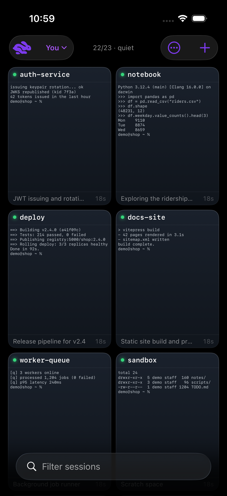
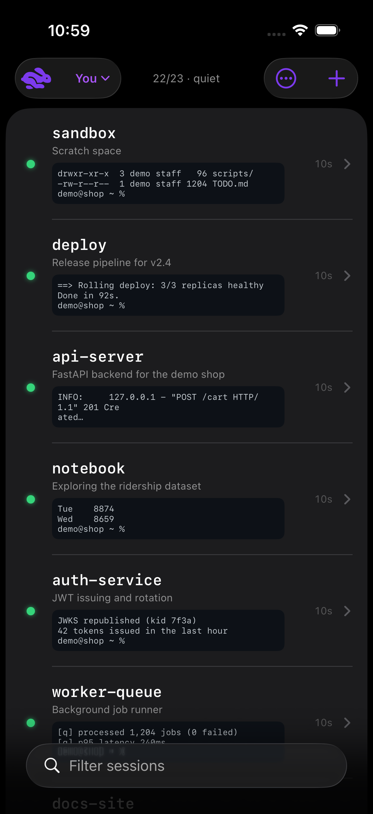
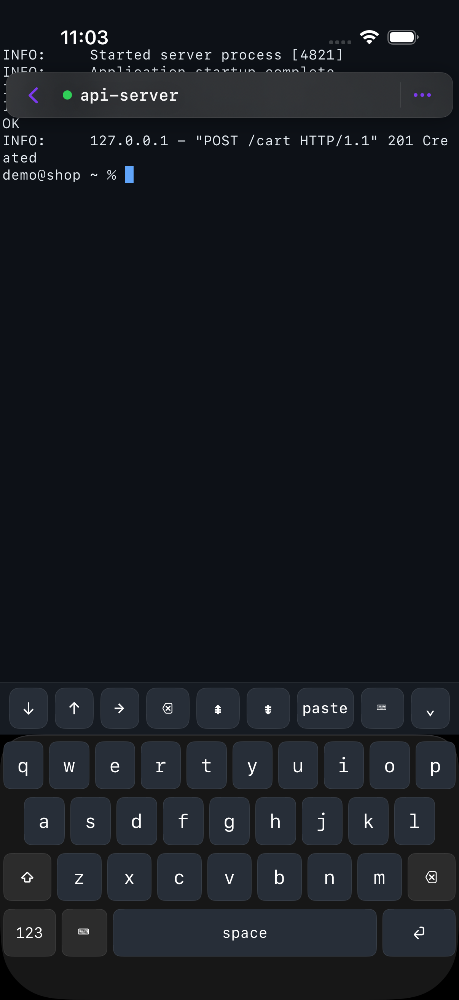
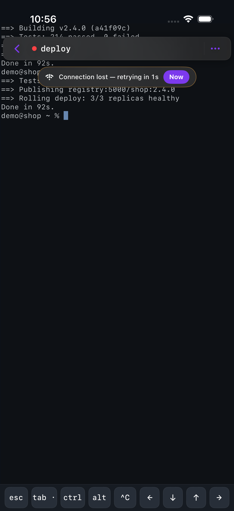

# hop-ios

A native iOS client for [hop](https://github.com/jzthree/hop) — your terminals
and agent sessions, on the phone, over your existing Cloudflare tunnel.

It exists because the web client hit iOS's ceiling: Safari can't give a real
keyboard (dictation, autocorrect, key repeat), can't do haptics since iOS 17.4,
and can't notify you when an agent wants attention. This app can.

Standalone by design: it consumes hop's public HTTP + WebSocket API and needs
**no changes to hop** to run. If it stops earning its keep, delete the repo.

<p align="center">




</p>

*(More in [`docs/screens/`](docs/screens/) — captured by the probe
harness against a synthetic demo fleet.)*

## Quick start

```bash
brew install xcodegen          # once
make test                      # unit suite in the simulator
make uitest                    # real gestures via XCUITest (~5 min, 28 tests)
make install                   # signed build -> connected iPhone
```

Then in the app: enter your hop URL (e.g. `hop.zhoulab.io` — the scheme is
optional), your hop password and a 6-digit authenticator code. The session
cookie lasts 7 days; the password can be remembered in the keychain so
re-login is one code.

Requirements: Xcode 26+, an Apple ID signed in to Xcode (Settings → Accounts),
Developer Mode enabled on the phone, and a hop daemon reachable at that URL.

## What it does

- **Account** — server address, session count, sign out (drops the cookie, the
  saved password, the badge and the quick actions); changing servers starts
  there.
- **Session list** — attention-first, with taglines, working directory, running
  app, relative time, and a 3-line live preview of each session's screen.
  Filter by name, cwd, app or tagline — or search the OUTPUT of every session
  at once (hop scans server-side and returns snippets). Scope to You / Agents
  / All. Create, rename, kill, and toggle
  agent (MCP) access.
- **Fast opens** — the session's current screen paints immediately over HTTP
  while the (much larger) WebSocket snapshot downloads.
- **Terminal** — SwiftTerm over hop's WebSocket, with the native keyboard plus
  a key bar (esc, tab, sticky ctrl, alt/meta, ^C, arrows, PgUp/PgDn, paste) —
  or the **hop keyboard**: a fixed-height in-app board (abc/123/#+= planes,
  mono face, every ASCII symbol one plane away) that sidesteps keyboard-switch
  resizing entirely. **Optimistic local echo** renders keystrokes before the
  tunnel answers. **Hold to select** a word (handles extend it; scrolling never
  fights selection), then tap the Copy chip. Taps become real SGR clicks in
  apps that asked for the mouse. Find in scrollback, copy/share screen or all,
  font size (menu or pinch), light/dark, jump-to-live, pill-swipe to the next
  session, and the full session sheet (rename, tagline, folder, park, fork,
  kill) without leaving the terminal. A disconnect shows an honest banner —
  real backoff countdown, retry-now — never two lines of red into your
  scrollback; brief blips show nothing at all.
- **Attention** — a session that rings the terminal bell raises a dot, a
  haptic, an app-icon badge, and (opt-in) a local notification that opens
  straight to it — or answers it: long-press the notification and REPLY from
  the lock screen. Long-press the icon for the four sessions most likely to
  want you. Never for the session you're currently watching.
- **Fleet organization** — group the wall by recency, by project (cwd), or by
  your own server-side **folders** (create and file from any session's
  long-press). **Fork** any session — a claude fork continues the conversation
  under a fresh id while the original runs on. Move sessions between You and
  Agents. Tile view renders live coloured miniatures of every screen.
- **System surface** — Siri/Shortcuts (open a session, fleet status, reply,
  new session), Spotlight (every session searchable), **Handoff** (walk to
  the Mac, the session follows into Safari), `hop://` deep links, Face ID
  lock, and an instant-launch cache: the wall paints at first frame from the
  last known state, then refreshes live.
- **Good pocket citizen** — polling follows the network: 5s on Wi-Fi, backed
  off on cellular, and Low Data Mode drops live previews entirely.
- **Resilience** — input typed during an outage is buffered and replayed
  (15s cap, so nothing stale lands late); auto-reconnect on foreground and
  after drops with backoff;
  a network blip never logs you out; unreachable servers fail fast with a
  readable error instead of hanging.

## Layout

| File | Role |
|------|------|
| `HopSpikeApp.swift` | app entry, theme, login screen |
| `AppModel.swift` | server URL/auth, session list + previews, session CRUD |
| `HayClient.swift` | hop's room WebSocket protocol (snapshot/output/presence/collab) |
| `TerminalScreen.swift` | SwiftTerm host, key bar, menus, control actions |
| `SessionsView.swift` | session list, scope/filter, empty states |
| `Notifications.swift` | bell → local notification, tap-to-open |
| `Keychain.swift` | remembered password (device-only, never the TOTP secret) |
| `NetworkConditions.swift` | NWPathMonitor: poll cadence, offline detection |
| `SessionFilter.swift` | pure list shaping (unit-tested) |
| `Links.swift` | URLs off the screen, wrap-aware (unit-tested) |
| `QuickActions.swift` | Home Screen shortcuts + the scene delegate they need |
| `AccountView.swift` | server info, sign out, version, Copy diagnostics |
| `HopBoard.swift` | the hop keyboard (fixed-height inputView, three planes) |
| `OptimisticEcho.swift` | local echo, ported from hop web's model |
| `FleetCache.swift` | instant launch: last known wall, on disk |
| `KBLog.swift` | the diagnostics ring: keyboard, wake, frame-gap traces |
| `Intents.swift` | Siri/Shortcuts: open, status, reply, new session |

## Talking to hop

- Auth: `POST /api/login` with `{password, totp}` sets the `tunnel_session`
  cookie. The daemon also accepts `Authorization: Bearer <secret>` or
  `?token=<secret>` — that's how the simulator skips TOTP in development.
- Sessions: `GET /api/sessions`; previews: `GET /api/sessions/preview?name=`;
  mutations: `POST /api/sessions{,/rename,/delete,/agent-permission}`.
- Terminal: `wss://<host>/ws?room=<internalName>&name=&cols=&rows=`.
- Size: hop elects the shared PTY size by typing recency. A plain `resize`
  needs every peer input-idle 60s; the first fit after attaching must send
  `claim: "attach"` (2.5s) or the phone renders at a desktop peer's width.

Two iOS traps worth remembering, both cost real debugging time:
1. `Cookie` is a **reserved** URLSession header — a manually set one is dropped
   unless `httpShouldHandleCookies = false`, and URLSession's own jar skips
   `Secure` cookies on `wss://`. Miss both and the upgrade 401s (Cloudflare
   reports that as 502).
2. `URLSessionWebSocketTask` caps messages at **1 MB** by default; hop's join
   snapshot is up to 1.5 MB, so any session with real scrollback dies right
   after a successful upgrade unless `maximumMessageSize` is raised.

## Development

`make sim` runs it in the simulator against your live daemon (auth via the
daemon's own token, no TOTP). `make sim OPEN=Solstice` opens a session
directly, and `make shot` grabs a screenshot.

Several app states can't be reached on demand — you can't wait for an agent to
ring, or unplug the simulator's network — so `make sim` takes flags that put
the app straight into them. A screenshot is the only way to review UI that no
test can see, so being able to *reach* a state matters as much as rendering it.

| `make sim` flag | Env var | Puts the app in |
|---|---|---|
| `OPEN=Orion` | `HOP_DEV_OPEN` | that session, via the real cold-launch path |
| `SCOPE=all` | `HOP_DEV_SCOPE` | You / Agents / All |
| `GROUP=1` | `HOP_DEV_GROUP` | grouped by project |
| `FILTER=text` | `HOP_DEV_FILTER` | with the search field pre-filled |
| `SHEET=account` | `HOP_DEV_SHEET` | the account sheet open |
| `OFFLINE=1` | `HOP_DEV_OFFLINE` | offline (simulators borrow the host's network) |
| `COMPACT=1` | `HOP_DEV_COMPACT` | the landscape layout, in portrait |
| `ATTN=1` | `HOP_DEV_ATTENTION` | one session wanting attention |
| `GONE=1` | `HOP_DEV_GONE` | the "session ended" state |
| — | `HOP_DEV_COOKIE` / `HOP_DEV_TOKEN` | authenticated without a TOTP code |
| — | `HOP_DEV_NOTIFY` | bell notifications pre-enabled |

`ATTENTION`, `GONE` and `COOKIE` are `#if DEBUG` — they fake app state or inject
a session, which has no place in a shipping build. The rest only pick a screen.

UI tests pass `-hop-ui-testing`, which stops the caret blinking. A blinking
caret is a permanent animation, and XCUITest waits for animations before every
interaction — with it on, each tap sat through a 60s timeout per interaction
and the suite became unrunnable.

### Which build am I running?

`⋯ → Server & account` shows the version, the git describe, and `· debug` when
it is an unoptimised build. `make install` ships Release; `make install-debug`
is the slow one, for attaching a debugger.

### Reading the app's diagnostics

The app logs the handful of numbers that explain its behaviour, under
subsystem `io.zhoulab.hop.spike`. Note `--info`: these are info-level and are
invisible without it.

Simulator:

```bash
xcrun simctl spawn <sim> log show --last 60s --info \
  --predicate 'subsystem == "io.zhoulab.hop.spike"'
```

On the phone, `log collect --device-udid` needs admin, so use **Console.app**:
open it, pick the iPhone in the sidebar, Start streaming, and put
`io.zhoulab.hop.spike` in the search box (Action → Include Info Messages).

| Line | What it tells you |
|------|-------------------|
| `attach claim 51x23 for X` | the phone claimed the shared PTY size — if absent, the terminal is wrapped at some other client's width |
| `room elected 80x50, we draw 51x23` | a peer holds the size and output will reflow until our claim wins. Not a bug: adopting their size would clip the bottom of the screen, where claude's input box is |
| `snapshot 339 KB after 96 ms` | what opening that session cost on the wire, and how long the server took |
| `fast paint 2 KB` | the pre-snapshot screen, so the terminal isn't blank while a big replay downloads |
| `connect X bg=0d1117` | the background we told the room, which decides the theme a TUI paints itself in. `ffffff` means light |
| `scrollback reachable N lines` | how much history find and copy-all can see (one screenful = an alt-screen app, which has none by design) |
| `scroll sent 12 bytes` | a drag reached the remote app as wheel events. 12 bytes is one notch |
| `scroll dropped, socket down` / `…control locked` | a drag went nowhere, and why: no connection, or someone else is driving |
| `coast braked by touch` | you stopped a flick mid-glide; that touch does nothing else, on purpose |
| `route wifi (change 3)` | the network route changed under us. A closed terminal reconnects at once instead of waiting out its backoff |
| `background slot requested` / `background slot refused: …` | whether iOS accepted a request to wake us later. **A refusal here means bells cannot reach a pocket at all** — the same pair is in Copy diagnostics |
| `background refresh finished, success=` | a pocket bell-poll actually ran. This is the only proof iOS ever grants a slot |
| `bell refused for X: …` | a notification could not be posted; it will be retried on the next poll rather than silently dropped |
| `terminal released` | leaving a session freed its 5000-line buffer and socket. Should appear once per session you back out of; if it stops, terminals are accumulating |
| `published N quick actions` | Home Screen shortcuts were refreshed — the only evidence, since SpringBoard owns them |
| `unhandled server message X` | hop added a protocol message this client ignores |
| `server rejected a message: …` | this client sent something hop couldn't parse — input may be silently broken |

Absence is often the signal. No `attach claim` means the size never went out;
no `background refresh finished` after a day means iOS has never woken the app,
which is the difference between "bells work in my pocket" and "bells work while
I'm looking at the screen".

`tools/lan-bridge.mjs` exposes the local hay-host to the LAN for testing
without a tunnel — it's LAN-open while running, so stop it when done.

Coordination notes and the running change log live in `STATUS.md`.
